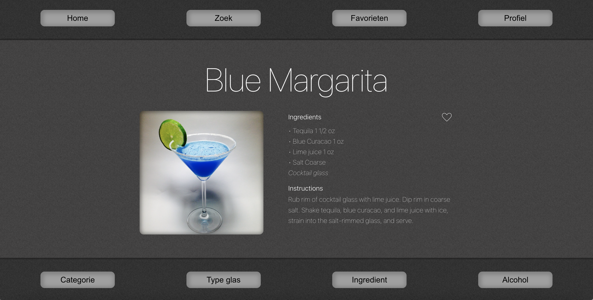

# Cocktail Bar

## Inleiding

Het vinden van een cocktailrecept kan vaak een moeilijk en omslachtig proces kan zijn. Er zijn talloze websites en boeken met recepten, maar deze zijn vaak moeilijk te navigeren.  De cocktailapp is bedoeld om Bezoekers een eenvoudige en intuïtieve manier te bieden om hun favoriete of nog nieuw te ontdekken cocktails te vinden, te bereiden en te genieten. De applicatie maakt gebruik van een externe databron om cocktailrecepten terug te geven. Het doel van deze applicatie is om gebruikers een breed scala aan cocktailrecepten te bieden.


## NOVI Backend

De backend gebouwd door NOVI draait op een Heroku server. Deze backend ondersteunt alleen het registeren, inloggen en aanpassen van gebuikers. Deze server wordt automatisch inactief wanneer er een tijdje geen requests gemaakt worden. De eerste request die de server weer uit de 'slaapstand' haalt zal daarom maximaal 30 seconden op zich kunnen laten wachten. Daarna zal de responsetijd normaal zijn. Daarom heb ik een test-request in het registreer formulier gezet. Let op: de database met gebruikers wordt vaak binnen één uur weer geleegd. Het is dus mogelijk dat u na verloop tijd opnieuw moet registreren.

## Applicatie starten
Als u het project gecloned hebt naar uw locale machine, installeer u eerst de `node_modules` door het volgende
commando in de terminal te runnen:

### `npm install`

Wanneer dit klaar is, kunt u de applicatie starten met behulp van:

### `npm start`

of gebruik de WebStorm knop (npm start). Open [http://localhost:3000](http://localhost:3000/) om de pagina in de browser
te bekijken. 

## Andere beschikbare scripts

"build": "react-scripts build",
"test": "react-scripts test",
"eject": "react-scripts eject"
### `npm build`
### `npm test`
### `npm eject`

### `npm update`

### `controle + C`


## Installatiehandleiding
In de voorgaande opdrachten heb je jouw ontwikkelwerk afgerond. Om ervoor te zorgen dat ook andere ontwikkelaars jouw project kunnen gebruiken, is het belangrijk een installatiehandleiding te schrijven waarin beschreven wordt wat zij hiervoor nodig hebben. Je schrijft jouw installatiehandleiding voor een mede-developer, maar zorgt ervoor dat dit ook te volgen is wanneer deze persoon geen enkele ervaring heeft binnen het frontend-landschap.
Het bevat:

### Een inleiding met korte beschrijving van de functionaliteit van de applicatie en screenshot van
de belangrijkste pagina van de applicatie.
### Lijst van benodigdheden om de applicatie te kunnen runnen (zoals runtime environments, een
API key of gegevens van een externe backend). Let op: je vraagt de nakijkende docent nooit zelf
een API key aan te maken. Jij levert zelf jouw API key aan in de handleiding;
### Een stappenplan met daarin installatie instructies.
### Met welke gegevens er ingelogd kan worden indien er al accounts beschikbaar zijn.
### Welke andere npm commando’s er nog beschikbaar zijn in deze applicatie en waar deze voor
dienen. Op te leveren:
### Zelfgeschreven README.md in de root van de React projectmap (.md)

## Available Scripts
```
https://github.com/wimtheijken/frontend-eindopdracht-cocktail-app
```


```
npm install
```
